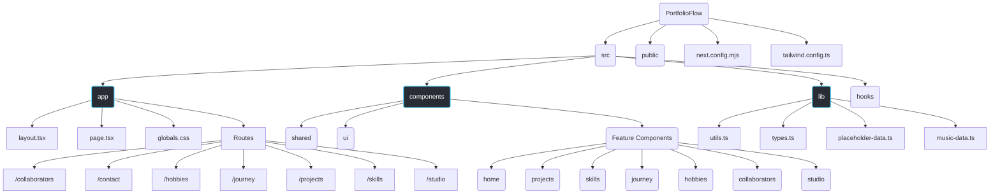

# PortfolioFlow: A Creative Personal Portfolio

Welcome to PortfolioFlow, a dynamic and modern personal portfolio website template built with the latest web technologies. This project is designed to showcase your work, skills, and professional journey in a visually appealing and interactive way.


## ✨ Features

- **Fully Responsive Design**: Looks great on all devices, from mobile phones to desktop computers.
- **Multiple Themed Pages**: Includes pre-built pages for Home, Projects, Skills, Journey, Hobbies, Collaborators, and a creative Studio.
- **Dark/Light Mode**: Easily switch between themes with a dedicated toggle.
- **Smooth Page Transitions**: Elegant animations between pages powered by Framer Motion.
- **Interactive UI Elements**:
  - **Custom Breather Cursors**: Choose between multiple "Demon Slayer" inspired breathing style cursors (Thunder, Hinokami Kagura, etc.) or turn them off.
  - **Background Music Player**: A persistent, expandable "Bento-style" music player with volume control, random tracks, and staggered animations.
  - **Animated Hero Sections**: Engaging and dynamic hero sections with background effects.
  - **Skills Visualization**: Toggle between Grid and List views to explore technical proficiency.
- **Dynamic Content**: Easily manage your portfolio content through simple data files.
- **Project Filtering**: A client-side search functionality on the Projects page.
- **Optimized Performance**: Lazy loading and async decoding for images to visual heavy pages.
- **Modern Tech Stack**: Built with Next.js App Router, TypeScript, and ShadCN UI for a high-quality, maintainable codebase.

## 🛠️ Tech Stack

- **Framework**: [Next.js](https://nextjs.org/) (App Router)
- **Language**: [TypeScript](https://www.typescriptlang.org/)
- **Styling**: [Tailwind CSS](https://tailwindcss.com/)
- **UI Components**: [ShadCN UI](https://ui.shadcn.com/)
- **Icons**: [Lucide React](https://lucide.dev/)
- **Animations**: [Framer Motion](https://www.framer.com/motion/)

## 📂 Project Structure

The project follows a standard Next.js App Router structure. Key directories are organized to separate concerns, making the codebase clean and easy to navigate.



- `src/app/`: Contains all the routes and pages of the application.
- `src/components/`: Houses all the React components, organized by feature (`/home`, `/projects`, etc.) and shared components (`/shared`, `/ui`).
- `src/lib/`: Includes utility functions, placeholder data, and type definitions.
- `src/hooks/`: Contains custom React hooks used across the application.
- `public/`: For static assets like images and fonts.

## 🚀 Getting Started

To run this project locally, follow these steps:

1. **Clone the repository:**

    ```bash
    git clone https://github.com/developersami04/sami-creative-portfolio.git
    cd sami-creative-portfolio
    ```

2. **Install dependencies:**

    ```bash
    npm install
    ```

3. **Run the development server:**

    ```bash
    npm run dev
    ```

Open [http://localhost:3000](http://localhost:3000) (or whichever port is assigned) in your browser to see the result.

## ✏️ Customization

To customize the portfolio with your own information, edit the files in the `src/lib/` directory:

- `src/lib/placeholder-data.ts`: Update this file with your personal information, projects, skills, and more.
- `src/lib/music-data.ts`: Customize the background music playlist.

---

## 👨‍💻 Author

| Profile | Developer Name | Role | GitHub | LinkedIn | X |
| :--- | :--- | :--- | :--- | :--- | :--- |
| [](https://github.com/saidulalimallick04) | Saidul Ali Mallick (Sami) | Backend Developer & AIML Engineer | [@saidulalimallick04](https://github.com/saidulalimallick04) | [@saidulalimallick04](https://linkedin.com/in/saidulalimallick04) | [@saidulmallick04](https://x.com/saidulmallick04) |

> ❤️ I believe in building impact, not just writing code.
> _💚 Backend Sage signing off.._
---
